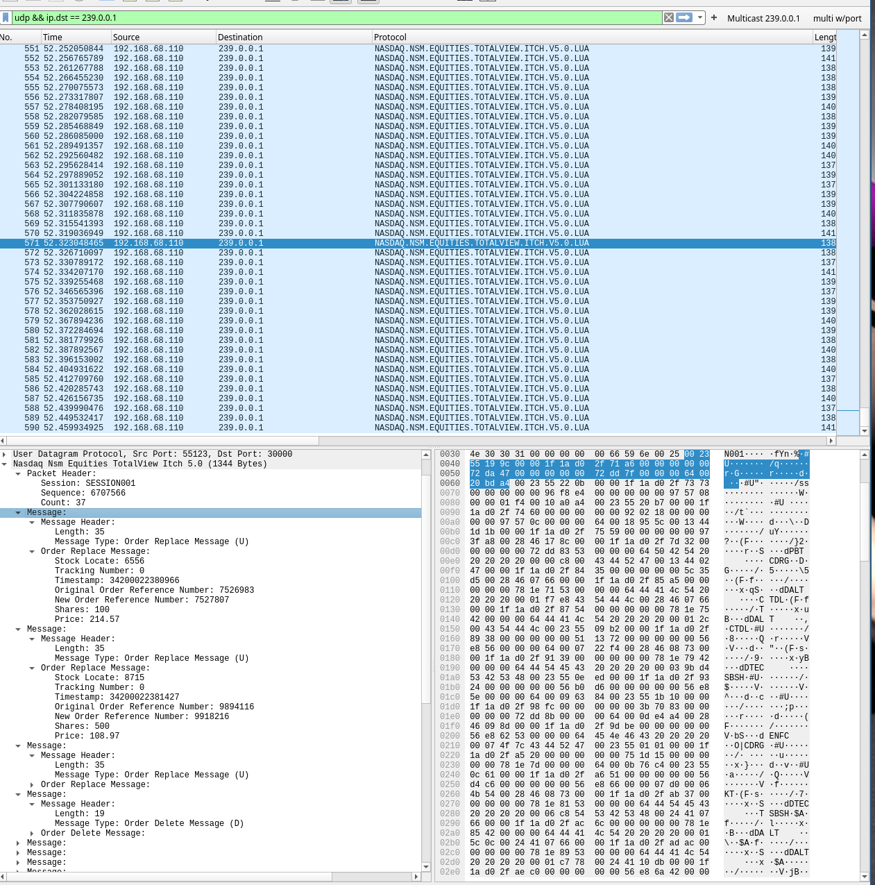

# ITCH Mold Replay
- Implements a [MoldUDP64](https://www.nasdaqtrader.com/content/technicalsupport/specifications/dataproducts/moldudp64.pdf) server that replays a binary [Nasdaq TotalView-ITCH](https://www.nasdaqtrader.com/content/technicalsupport/specifications/dataproducts/NQTVITCHSpecification.pdf) file.
- Downstream server multicasts ITCH messages, using the original timestamps for absolute time-based replay pacing.
- Retransmission server for handling client requests for lost or missed messages by sequence number.

## Build
### Requirements
- Linux
- `g++` >= 14
- `cmake` >= 3.20
- `ninja` 
  - If using the `cmake` presets
```bash
git clone https://github.com/jamisonrobey/itch-mold-replay.git --recursive
cd itch-mold-replay
cmake --preset release
cd build-release && ninja
```
### CMake Presets
```
cmake --list-presets
Available configure presets:

  "debug"                       - Debug
  "debug-no-network"            - Debug (No Network)
  "debug-no-sleep"              - Debug (No Sleep)
  "debug-no-network-no-sleep"   - Debug (No Network, No Sleep)
  "release"                     - Release
  "release-no-network"          - Release (No Network)
  "release-no-sleep"            - Release (No Sleep)
  "release-no-network-no-sleep" - Release (No Network, No Sleep)
```
## Usage
### Replay file
- You can obtain TotalView-ITCH data from [emi.nasdaq.com/ITCH/](https://emi.nasdaq.com/ITCH/)
  - You will need to decompress the file before using
### Running
```
./itch-mold-replay --help

./itch-mold-replay [OPTIONS] session itch_file_path


POSITIONALS:
  session TEXT REQUIRED       MoldUDP64 Session
  itch_file_path TEXT:FILE REQUIRED
                              NASDAQ ITCH 5.0 binary message file

OPTIONS:
  -h,     --help              Print this help message and exit
          --downstream-group TEXT [239.0.0.1]
                              Downstream group
          --downstream-port INT:INT in [1025 - 65535] [30000]
                              Downstream port
          --ttl INT:INT in [0 - 255] [1]
                              Downstream TTL
          --loopback          Enable downstream multicast loopback
          --retrans-address TEXT [127.0.0.1]
                              Retransmission server address
          --retrans-port INT:INT in [1025 - 65535] [31000]
                              Retransmission server port
          --replay-speed, --speed FLOAT:POSITIVE [1]
                              Downstream replay speed
          --start-phase, --phase, --start ENUM:value in {close->2,open->1,pre->0} OR {2,1,0} [0]
                              Market phase to start replay (pre, open, close)
```
### Example run configurations
```bash
# w/ defaults
./itch_mold_replay SESSION001 path/to/itch_file
# w/ loopback and ttl 2.0
./itch_mold_replay SESSION001 path/to/itch_file --loopback --ttl 2
# w/ replay_speed 50x and starting at market open
./itch_mold_replay SESSION001 --replay-speed 50x --start-phase open 
```
## Useful tools 
### Traffic control (`tc`)
When this server and a client are on the same network or machine, you will observe a reliable connection which is not very useful if you're trying to test handling out-of-order or missing packets with your client. You can use [tc](https://man7.org/linux/man-pages/man8/tc.8.html) to introduce packet loss, reordering, latency jitter etc if desired.
### Wireshark
- ITCH dissectors for Wireshark by the Open Market Initiative for visualizing the output
- The image below is a capture of the multicast feed decoded in Wireshark using the [Nasdaq_Nsm_Equities_TotalView_Itch_v5_0_Dissector.lua](https://github.com/Open-Markets-Initiative/wireshark-lua/blob/main/Nasdaq/Nasdaq_NsmEquities_TotalView_Itch_v5_0_Dissector.lua):


## More info / Blog Post
[Blog post](https://jamisonrobey.github.io/moldudp64-totalview-itch-replay-server/) about the implementation.

